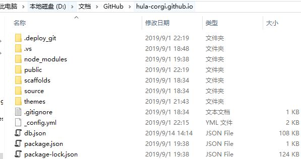

### 参考网站
[Hexo官网](https://hexo.io/)   
[Hexo文档](https://hexo.io/docs/)    

### 博客本地路径目录结构


### 运行本地预览
``` 
$ hexo s
```
### 生成网站
``` bash
$ hexo g
```
### 发布到远程站点
``` bash
$ hexo d
```
### Hexo 多电脑部署
[参考](https://www.jianshu.com/p/0b1fccce74e0)
